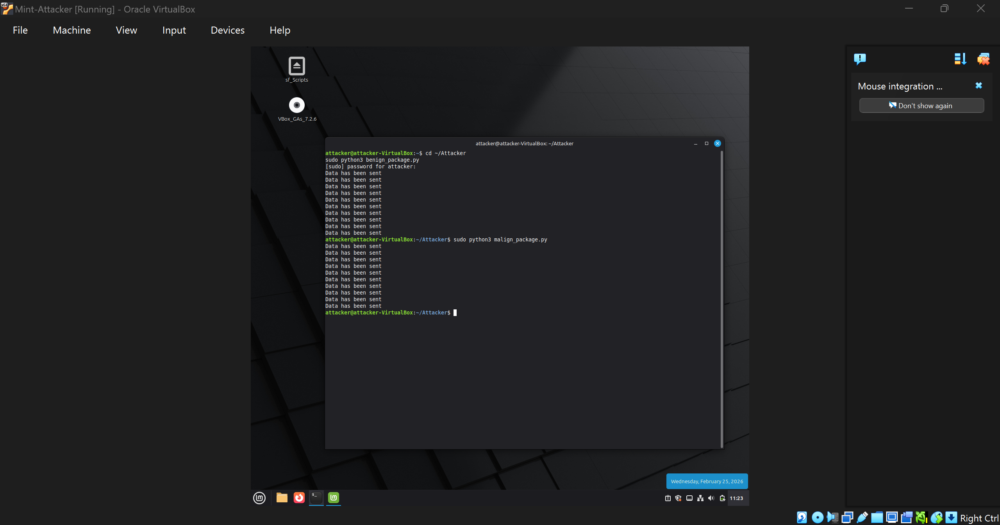
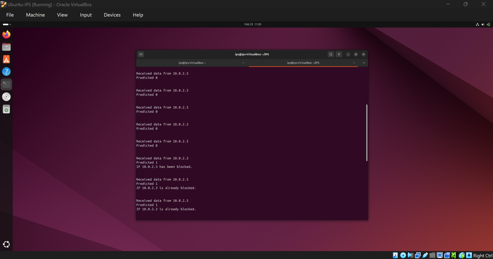

# (IPS) Using Machine Learning

This project provides an Intrusion Prevention System. It uses a machine learning model to look at network traffic and block malicious IP addresses automatically.

The main focus of this setup is the deployment. It captures live network packets, sends them to a pre-trained model to check if they are dangerous, and then uses Linux firewall rules (iptables) to instantly block the attacker.

## Requirements and Installation

To run this project, you need to set up two VirtualBox Linux machines connected on an internal NAT network.
- The Defender: An Ubuntu machine that runs the IPS.
- The Attacker: A Linux Mint machine that sends the bad traffic.

### Setting up the Defender (Ubuntu)
1. Allocate at least 4GB of RAM to this virtual machine.
2. Open a terminal and update your package list:
```bash
sudo apt update
```
3. Install the required system tools and Python libraries:
```bash
sudo apt install python3 iptables wireshark
sudo apt install python3-scapy python3-numpy python3-joblib python3-pyshark python3-pandas python3-requests python3-json python3-subprocess
```

### Setting up the Attacker (Linux Mint)
1. Open a terminal and update your package list:
```bash
sudo apt update
```
2. Install Python and the necessary libraries for sending traffic:
```bash
sudo apt install python3 python3-scapy python3-pandas
```

## How to Run the Project

The IPS relies on two scripts running at the same time on the Ubuntu machine.

1. First, start the prediction server. Open a terminal, go to the `IPS/Scripts/Client` folder, and run:
```bash
python3 rest_controlled.py
```
2. Next, start the network monitor. Open a second terminal in that same folder and run:
```bash
sudo python3 package_receive_controlled.py
```

### Testing the Defenses
Go to your Linux Mint virtual machine. Open a terminal in the `IPS/Scripts/Attacker` folder.

To test the system with an attack, run:
```bash
sudo python3 malicious_traffic_sender.py
```
If everything is set up correctly, the Ubuntu machine will detect the attack, print a warning in the terminal, and permanently block the IP address of the Linux Mint machine using iptables.

### System Outputs

Here are examples of the system in action during an attack:

**Attacker Execution:**


**Defender (IPS) Detection and Blocking:**


## Training Your Own Model

This project comes with pre-trained models in the `models/` folder so you can test the deployment right away. However, if you want, you can train your own machine learning model.

To do this:
1. You will need to download a network traffic dataset, such as the CICIDS2017 dataset.
2. Write or modify Python scripts (using libraries like pandas and scikit-learn) to process the dataset and train a model.
3. Save your trained model as a `.pkl` file (for example, using joblib) and replace the existing models in the `models/` folder.
4. The prediction server (`rest_controlled.py`) will load your new model to evaluate traffic.
